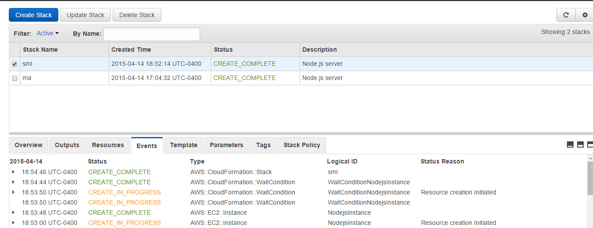

MILESTONE 3 - CSC591 DevOps
-------------------------------

Project Team Members:

1] Priyanka Shankaran (priyan)

2] Smitha Sathyanarayana (ssathya)

-------------------------------

**Step 1: The ability to configure a deployment environment automatically, using a configuration management tool, such as ansible, or configured using vagrant/docker.**

1] The remote deployment environment that we have chosen as part of our project is AWS EC2. 

2] For automatic configuration, we have used  AWS CloudFormation templates.

3] This cloudFormation template in turn creates EC2 instances automatically.

4] The screenshot below shows a small sample of our CloudFormation template file. The repository contains a gistfile1.js which contains the entire code of our CloudFormation template. 

We can see that git is automatically configured on our EC2 instance. Any other project dependencies can also be set up using  AWS CloudFormation.

 

**Step 2: The ability to deploy a self-contained/built application to the deployment environment. That is, this action should occur after a build step in your pipeline.**
 
1] We are using Jenkins as our build server. Our deployment to the EC2 instances will be successful only after the build is successful in Jenkins. 

2] For Jenkins to talk to the EC2 deployment servers, we have configured the 'publish over SSH' plugin in Jenkins as seen in the screenshot below.

3] We have the following instances as our deployment servers. 

4] The following configuration has been done on 52.5.190.167 to deploy the first version of our application.

 

**Step 3: The deployment must occur on an actual remote machine/VM (e.g. AWS, droplet, VCL), and not a local VM.**

1] To check if our application has deployed successfully on the remote EC2 instance, type the public IP address of the EC2 server to view the application. This can be seen below. 

**Step 4: The ability to perform a canary release.**

1] For performing a simulation of Canary Release, we initially deployed the production version of the application on two EC2 instances. 

2] Then we selectively chose 52.5.183.101 as our canary deployment server. We then deployed the newer version "blue" to the canary server. 

3] Thus we are considering the server with IP address 52.5.190.167 as our production server and the server with IP address 52.5.183.101 as our canary server.

4] In this step, we simply monitor the canary server for instability or faults and kill the canary, if the application behaves erroneously.

**Step 5: The ability to monitor the deployed application for alerts/failures (using at least 2 metrics).**

1] In this step, we monitored the canary server with the code, which can be found at this link https://github.com/priyanka-smitha/Monitoring. We used the following two metrics, as can be seen in the figure, for the application, to check its health and behaviour.   

2] We have a proxy server running on port 4000, of the canary, which always points to the production server. 

3] Thus, we can fall back to this server, if some error condition occurs to the canary server, as can be seen in the image below. 

4] The canary **dies** when the CPU has a load higher than a particular threshold, and the proxy routes the traffic of the canary to port 4000 as seen below.

The configuration file of Jenkins can be found in our repository and is called 'config.xml'. 

