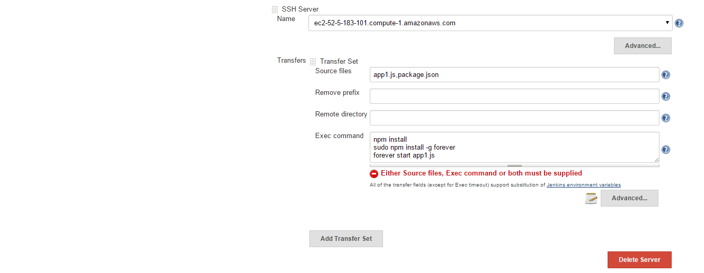

MILESTONE 3 - CSC591 DevOps
-------------------------------

Project Team Members:

1] Priyanka Shankaran (priyan)

2] Smitha Sathyanarayana (ssathya)

-------------------------------

**Step 1: The ability to configure a deployment environment automatically, using a configuration management tool, such as ansible, or configured using vagrant/docker.**

**Step 2: The ability to deploy a self-contained/built application to the deployment environment. That is, this action should occur after a build step in your pipeline.**

**Step 3: The deployment must occur on an actual remote machine/VM (e.g. AWS, droplet, VCL), and not a local VM.**

**Step 4: The ability to perform a canary release.**
1] For performing a simulation of Canary Release, we initially deployed the production version of the application on two ec2 instances as can be seen from the figure below. 

**Step 5: The ability to monitor the deployed application for alerts/failures (using at least 2 metrics).**

